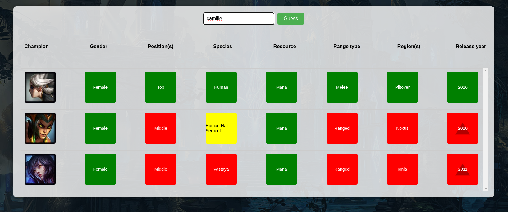

# Pyloldle: The League of Legends Guessing Game

Welcome to Pyloldle, where your knowledge of League of Legends champions is put to the test!

## Introduction

Pyloldle is a guessing game centered around the vast universe of League of Legends champions. Your task? Deduce the secret champion using clues provided by the game. With each guess, you'll receive feedback on the properties that match and those that don't. Use this information to refine your next guess and get closer to the answer!

## How to Play

1. Start the game.
2. Make a guess by typing in a champions name.
3. Review the feedback provided, noting which properties match the secret champion.
4. Use the feedback to make more informed guesses.
5. Continue guessing until you've identified the secret champion!

## Feedback
Your feedback is invaluable! If you have suggestions, comments, or encounter any issues, please open an issue on this repository.

---

Thank you for playing Pyloldle and testing your League of Legends champion knowledge!

